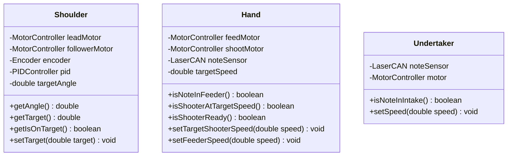

```mermaid

classDiagram

    class Shoulder {
        -MotorController leadMotor
        -MotorController followerMotor
        -Encoder encoder
        -PIDController pid
        -double targetAngle

        +getAngle() double
        +getTarget() double
        +getIsOnTarget() boolean
        +setTarget(double target) void
    }

    class Hand {
        -MotorController feedMotor
        -MotorController shootMotor
        -LaserCAN noteSensor
        -double targetSpeed

        +isNoteInFeeder() boolean
        +isShooterAtTargetSpeed() boolean
        +isShooterReady() boolean

        +setTargetShooterSpeed(double speed) void
        +setFeederSpeed(double speed) void
    }

    class Undertaker {
        -LaserCAN noteSensor
        -MotorController motor

        +isNoteInIntake() boolean
        +setSpeed(double speed) void
    }

```